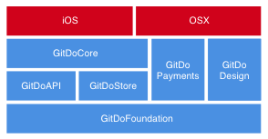

### Other companies examples

## GitDo :octocat:

- **AppStore link**: [Link](https://itunes.apple.com/us/app/gitdo-issues-management-for/id991328409?mt=8)
- **Stack description:** The stack is setup with CocoaPods for local and external dependencies. The stack is currently being reused for the iOS and the OSX application that is coming.
- **Stack diagram:**

## Add yours here :rocket:
